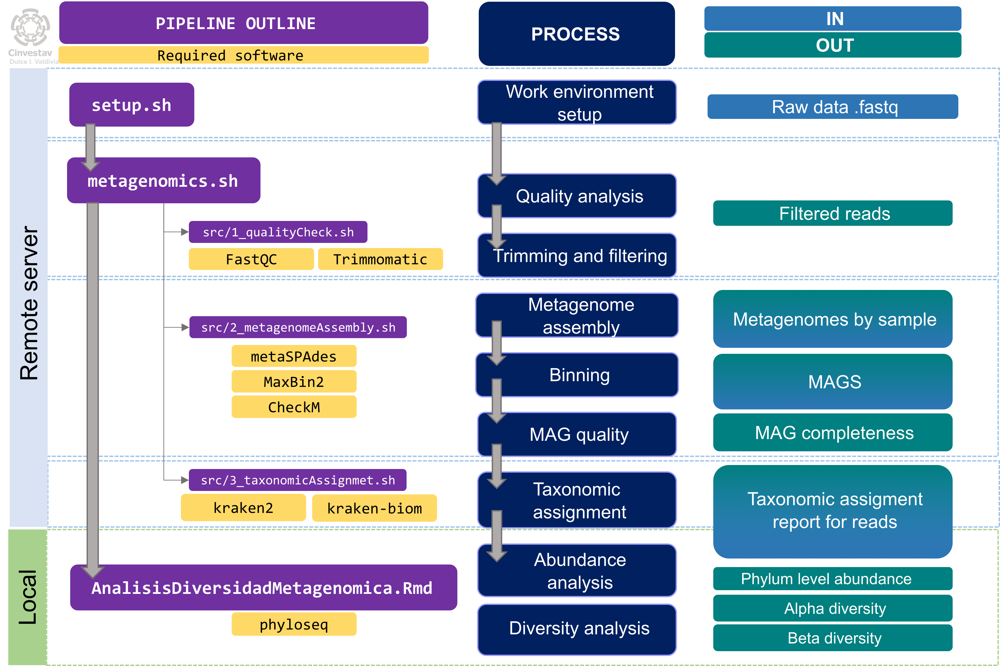

# Metagenomics

In this repository is the pipeline for metagenomic analysis of samples for the CONACYT project 319773: 

***"Producción de biocombustibles para uso rural a partir de desechos agropecuarios mediante la optimización de consorcios microbianos usando metagenómica"***  

*"Production of biofuels for rural use from agricultural waste by optimization of microbial consortia using metagenomics"*

## Pipeline outline

## Github Content:

- **install**: Contains a raw file listing the software needed for this pipeline and the instructions for installing it. More detail info on installation is availabl on the User´s manual.
- **doc**: Contains the Users manual for the pipeline as well as repository images of the pipeline´s flowchart.
- **src**: Contains the scrips for running the pipeline up until taxonomic assignment. For `botanero.cs.cinvestav.mx`server users, a copy of this folder can be found at `/home/metagenomics/projects/biodigestores/metaPipeline`
- **analysis-r**: Contains the script necessary for running the abundance and diversity analysis on local computer (.Rmd), as well as a compiled tutorial on pdf.

